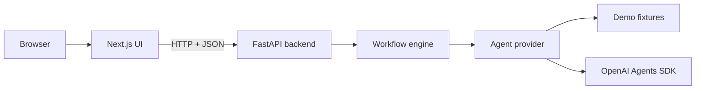
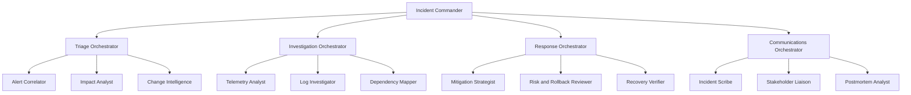
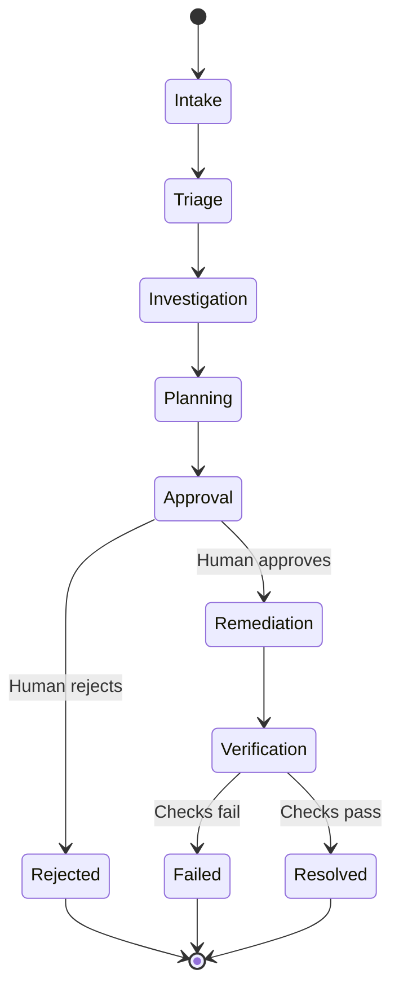

# Twemp architecture

## Service boundary

Twemp runs as two services:

The Next.js app renders the command center and validates responses at the network boundary.
FastAPI owns orchestration, validation, provider selection, and run state. Model credentials
never leave the backend process.

## Hierarchy

The Incident Commander owns global workflow state. Each sub-orchestrator receives a bounded mission, fans work out to its specialists in parallel, validates their results, and returns one team report to command.

## Lifecycle

The engine cannot transition from `Approval` to `Remediation` without a validated `ApprovalDecision`. A rejected or repeated decision cannot execute the plan.

## Execution model

1. FastAPI validates incident input with Pydantic and blocks likely secrets.
2. The provider factory selects deterministic demo mode unless `AGENT_PROVIDER=openai` is set.
3. The engine creates all 17 runtime nodes and activates the Incident Commander.
4. Triage specialists run concurrently via `asyncio.gather`, followed by team synthesis.
5. Investigation specialists run concurrently, followed by team synthesis.
6. Response planning specialists run concurrently; the Response Orchestrator creates a bounded plan.
7. Communications specialists prepare the timeline and stakeholder narrative.
8. The engine persists a pending approval and marks downstream agents as blocked.
9. A human approves or rejects through a separate endpoint.
10. Approved actions are recorded as controlled simulations in this reference implementation.
11. Recovery verification must pass before the Postmortem Analyst and Incident Commander can
    resolve the run.

## Provider boundary

`AgentProvider` is a Python `Protocol` and the only interface between orchestration code and
reasoning implementations. It exposes five bounded operations:

- specialist analysis;
- team synthesis;
- remediation planning;
- recovery verification; and
- incident closure.

The demo provider returns deterministic fixtures. The OpenAI provider creates a specialized SDK
agent per operation with `output_type` structured outputs, then normalizes and re-validates each
result against the strict domain contract before it reaches workflow state.

## State and transport

- `backend/app/workflow/schemas.py` is the contract source of truth; `src/lib/workflow/schemas.ts`
  mirrors it for client-side validation.
- JSON is camelCase and timestamps are ISO-8601 with a `Z` suffix.
- Errors use `{"error": string, "details"?: string[]}` for every failure mode.
- Endpoints create a run, retrieve a run, and submit an approval decision.
- A thread-safe, bounded in-memory repository keeps up to 50 runs for the local reference app.
- Every event receives a monotonic sequence number; ordering is based on sequence, not timestamps.

For production, replace the in-memory repository with a transactional database and add optimistic
concurrency or idempotency keys to the decision endpoint.

## Safety properties

- Demo mode is the default and does not require credentials.
- Model selection and API credentials stay in the backend process.
- CORS is restricted to configured frontend origins with only `GET` and `POST` allowed.
- Unknown request fields are rejected (`extra="forbid"`).
- Secret-like request content is rejected before provider invocation.
- Model outputs are schema-validated, clipped, and normalized.
- No shell, deployment, infrastructure, or hosted tool is exposed to an agent.
- Tracing is disabled for the OpenAI provider unless explicitly enabled; sensitive trace payload
  capture remains disabled.
- Remediation is impossible before a human approval record exists.
- Deciding an already-settled approval returns `409` instead of re-running the plan.
- Verification fails closed.
- Unhandled server errors are logged internally and returned as a generic message.
- The reference remediation adapter records simulations only.

## Production extension points

Before connecting Twemp to real systems:

1. use durable, encrypted workflow storage instead of the in-memory repository;
2. authenticate users and authorize approvers;
3. add idempotency and single-decision transaction guarantees;
4. expose narrowly scoped remediation tools with independent input/output guardrails;
5. require tool-level approval immediately before each side effect;
6. redact tenant data before model calls and telemetry export;
7. connect real observability evidence rather than model-generated observations;
8. add eval datasets, failure injection, audit retention, and provider timeouts;
9. separate proposal, execution, and verification credentials; and
10. run the API behind a gateway that enforces TLS, rate limiting, and request size limits.
